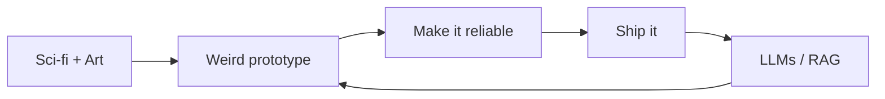

  

  

  

  
  
  
  

---

<h2 align="center">About me</h2>

  I grew up on <b>sci-fi movies</b> and <b>creative art</b>. That mix never left. 
  I want software to feel like a world you can step into — not a form you have to survive.

  <b>My rule:</b> build the weird version first. Then make it reliable. 
  The first draft should surprise people. The last draft should not break at 2 a.m.

  
  

---

<h2 align="center">What I work with</h2>

<table align="center">
  <tr>
    <td align="center" width="33%">
      <h3>Every day</h3>
      
Contest clock. Blank editor. C++.

      
<kbd>C++</kbd> &nbsp; <kbd>LeetCode</kbd> &nbsp; <kbd>Codeforces</kbd>

      
    </td>
    <td align="center" width="34%">
      <h3>When I ship</h3>
      
Full-stack product work.

      
<kbd>React</kbd> <kbd>Node</kbd> <kbd>Express</kbd> <kbd>MongoDB</kbd> 
      <kbd>Flutter</kbd> <kbd>Java</kbd> <kbd>Python</kbd> <kbd>GCP</kbd>

      
    </td>
    <td align="center" width="33%">
      <h3>Exploring</h3>
      
AI tools I am actually learning.

      
<kbd>LangChain</kbd> &nbsp; <kbd>LLMs</kbd> &nbsp; <kbd>RAG</kbd>

      
    </td>
  </tr>
</table>

  

---

<h2 align="center">GitHub</h2>

  
  

  

  

  

  

---

  

  <i>If you scrolled this far: I still debug like the hero in a sci-fi movie — badly, at first, then all at once.</i>

