  

  

  

  
  
  
  

---

<h2 align="center">About me</h2>

  I am a full-stack developer who likes competitive programming and building products that actually ship. 
  Outside of code I watch films and make art — that is just the side of the brain that keeps ideas interesting, not the whole personality.

  <b>How I build:</b> start with a strange first version. Then harden it until it is reliable. 
  Surprise people in the draft. Do not surprise them at 2 a.m. in production.

  
  

---

<h2 align="center">What I work with</h2>

<table align="center">
  <tr>
    <td align="center" width="33%">
      <h3>Every day</h3>
      
Contest clock. Blank editor. C++.

      
<kbd>C++</kbd> &nbsp; <kbd>LeetCode</kbd> &nbsp; <kbd>Codeforces</kbd>

      
    </td>
    <td align="center" width="34%">
      <h3>When I ship</h3>
      
Full-stack product work.

      
<kbd>React</kbd> <kbd>Node</kbd> <kbd>Express</kbd> <kbd>MongoDB</kbd> 
      <kbd>Flutter</kbd> <kbd>Java</kbd> <kbd>Python</kbd> <kbd>GCP</kbd>

      
    </td>
    <td align="center" width="33%">
      <h3>Exploring</h3>
      
AI tools I am learning now.

      
<kbd>LangChain</kbd> &nbsp; <kbd>LLMs</kbd> &nbsp; <kbd>RAG</kbd>

      
    </td>
  </tr>
</table>

  

---

<h2 align="center">GitHub</h2>

<!-- These images live in this repo. Public Vercel stats/trophy hosts are often paused or return 402. -->

  
  

  

  

  <picture>
    <source media="(prefers-color-scheme: dark)" srcset="https://raw.githubusercontent.com/Pratik168960/Pratik168960/output/github-contribution-grid-snake-dark.svg" />
    <source media="(prefers-color-scheme: light)" srcset="https://raw.githubusercontent.com/Pratik168960/Pratik168960/output/github-contribution-grid-snake.svg" />
    
  </picture>

---

  

  <i>If you made it this far, the bug is probably a missing semicolon. It always is.</i>

