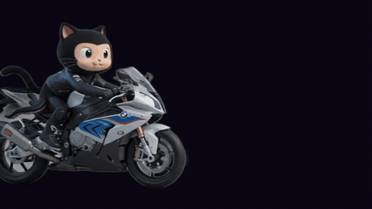

  

<!-- GitHub cannot autoplay MP4 in a profile README. An animated GIF in  starts as soon as the profile loads. -->

  

  

  

  
  
  
  

  

---

<h2 align="center">
  About me
  
</h2>

  Full-stack developer, competitive programmer, and AI enthusiast. 
  I like building things people can actually use — and winning the argument with the compiler along the way.

  <b>How I build:</b> build it weird. Then make it reliable.

  

---

<h2 align="center">What I work with</h2>

<table align="center">
  <tr>
    <td align="center" width="50%">
      <h3>Daily</h3>
      
Competitive programming, GitHub, Python, and JavaScript.

      
<kbd>CP</kbd> &nbsp; <kbd>GitHub</kbd> &nbsp; <kbd>Python</kbd> &nbsp; <kbd>JS</kbd>

      
    </td>
    <td align="center" width="50%">
      <h3>Heavy</h3>
      
MERN when it ships. Java when it has to scale.

      
<kbd>MongoDB</kbd> <kbd>Express</kbd> <kbd>React</kbd> <kbd>Node</kbd> <kbd>Java</kbd>

      
    </td>
  </tr>
</table>

  

  

---

<h2 align="center">GitHub</h2>

  
  

  

  

  <picture>
    <source media="(prefers-color-scheme: dark)" srcset="https://raw.githubusercontent.com/Pratik168960/Pratik168960/output/github-contribution-grid-snake-dark.svg" />
    <source media="(prefers-color-scheme: light)" srcset="https://raw.githubusercontent.com/Pratik168960/Pratik168960/output/github-contribution-grid-snake.svg" />
    
  </picture>

  

---

  

  <i>If you made it this far, the bug is probably a missing semicolon. It always is.</i>

